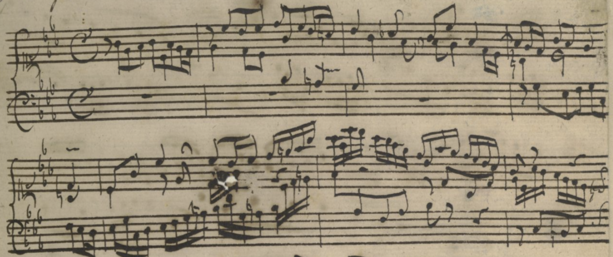

---
title: "Introduction to Data"
output: pdf_document
date: '2019-01-10'
...

```{r include = FALSE}
library(tidyverse)
library(HumanitiesDataAnalysis)

```

# An Introduction to Data

## Data Types

Maybe you've hear this: computers store everything as binary data. Programs, numbers, text, images: in the end, 
all are reduced to a soup of ones and zeros. But data is not a primordial soup; in all computer languages, there are 
"types." As Alex Gil once said on the Humanist mailing list, if you imagine a circle drawn on a chalk board, it can be
anything--a number zero, a letter "O", an off switch, a mouth. Before you work with symbols in a computer, you must decide which it is.
The same block of data on a hard drive can mean three completely different things depending on whether you treat it as a number, a fraction, 
or a letter; in order to work with digital data you have to come to terms with the ontology. 

In practice, this means the basics of data are these ontologies of things. The most fundamental concept
is that of **data types**. We'll work with many, but there are four that are so fundamental that you cannot
do any work without beginning to understand them.

### Numbers

Numbers are data. Sometimes we think of numbers as the presumptive form of data, which isn't quite right; but 
they are the one that the modern computer was tuned most explicitly to create, process, and transform.

In R, a number is represented the same way we normally do in text: by typing it in digits.

Here is how you represent a number in R:

```{r, echo = FALSE}
1789
```

This probably seems self-evident, but in reflecting on the limitations of computers it's worth
thinking about all the ways that a computer *can't* represent this number:

* In English: `One thousand, seven hundred and eighty-nine`. Computer languages are *sort* of in English; they use a number
  of English words. But you can probably see the absurdity of typing something
  like this and expecting a computer to calculate with it.
* In some other notation system: `MDCCXXXIX`. Computers are specific in that they treat Arabic numbers as real numbers.
* With formatting: `1,789`. Humans use formatting on data to better understand them:
  but a computer expects a number to be simply a set of digits bound together.

#### Types of Numbers

In some data analysis, there are important distinctions between different types of numbers.
This is most important when it comes to fractional and irrational numbers; although you can precisely
enumerate a number like '4,294,967,295' in a binary system, an irrational number like 'pi' can only 
be approximated. In some languages, like python, you will need to handle important distinctions
between 'integer' and 'numeric' (or 'floating-point') types. In R, you are generally safe using 'numeric' 
and not worrying about the difference.

### Textual data

If numbers are the basic data for the sciences, *text* is the basic type for much humanities work.
The fundamental unit of text is the **character**; a single letter at a time. Since computers store
things in binary, to store a letter on a computer means turning it into a binary number.

How many letters are there? I'll forgive you if your knee-jerk response is "26." But even for a lightly equipped printer,
the number is much higher; there are upper-case and lower-case letters, for example, and punctuation marks,
and spaces, and the numbers that we used to write '1789.' Each of these requires a different number (or 'code point')
to represent it in a computer's internal language. In all, there are 128 letters in the world, each of which a computer 
represents with its own binary code.

#### Strings

Though we set type in characters, we read in words. So while 'character' is the basic type, the 
thing that we most often want to work with is a sequence of characters all bound together. 
This data type is called a 'string' because it lines up a bunch of characters together into a 
line together. It's represented in R (as in most computer languages) with quotation marks. A string
can be a single word or the full works of William Shakespeare; and it's always represented simply 
as characters between quotation marks.

```{r, echo = FALSE}
"Just as there are rational requirements on thought, there are rational requirements on action, and altruism is one of them."
```

By putting together strings of 128 characters, you can represent any idea that anyone has ever or will ever write.

#### Character encoding

But, you might say, wait! There aren't just *English* letters; there's the "ñ" character from Spanish? What about that?
Or an o with an umlaut? And the the whole Cyrillic alphabet, and Japanese Kanji characters, and full set of Chinese texts?

This a good question, and one that took the various nationally-oriented worlds of computer interaction a surprisingly long
time to fix. In the first decades of computing, every language had its own set of standards, and you would always have to tell 
a program if you were reading in Russian, or English, or Spanish text.
Around 1990, engineers in California started to work on a unified standard for text--"Unicode"--that allows all languages to be represented in the same way;
rather than having just 128 letters, it gives a extensible universe with hundreds of thousands of possible characters. Egyptian hieroglyphics, 

But--and this is something that every humanist must reckon with--the difference between those first 128 letters, which is known as the ASCII set, and the rest of the 
unicode standard remains significant. Some historical languages, like Sogdian,have only been added as of 2018; other languages are still in flux, such as the lowercase Cherokee letters added in 2015.


### Other data types, vectors, and dataframes.

We'll encounter many more specific types in this course. As time
goes on, we'll look at complicated data types like **regression models** or **word embeddings**; 
there are also simpler ones like dates and so-called 'functions.'

Most of these are formed by combining together other data types in various ways.
There are two especially important ways of combining data together.


#### Vectors

One is the `vector`. A vector is, simply, a sequence of data points of the same fundamental type. 
It is created by writing a comma-delineated list, and wrapping it in parenthesis with a `c` at the 
beginning. (That `c` is technically another basic data type called a 'function'; we'll explore it more later.)

What distinguishes a vector from just a sequence of elements (which is called, in R, a **`list`** is that each piece must be of the same type. A vector
can contain strings or letters, but not both. In fact, if you try, R will quietly correct you by turning them into the same type.s

```{r}
c("a", "b", "c")
c(1, 2, 3)
c(1, 2, "3")
```

#### Dataframes (tibbles)

Most data is *about* something. In this class, we'll assume that all data is.

If you add one more layer of abstraction in R you reach the "data frame." 
This is the fundamental unit of data we'll work with: it represents a 
series of vectors bound together into, as the name implies, a frame.

A dataframe resembles a more formalized version of a spreadsheet: it has columns
that represent data series, and rows that represent a single observations.

Each of these columns has names that represent the type of data stored in them.

You can create a dataframe by defining each of the lists, as below. In reality, though,
you will almost always read data in from elsewhere.

```{r}
library(tidyverse)
data_frame(city = c("Boston", "New York", "London"), population = c(600000, 8000000, 6000000))
```


## Formal languages

To manipulate data, you need a formal language. Computers are literal beasts, and they require incredibly explicit 
instructions to get anything done.
As with `1,789`, computers tend to have only a single way to work with abstractions that human beings approach in
a variety of ways. To work with data, you have to learn at least one of the computational ways of looking at this data.

There is no one, single thing called 'computer programming' 
that you can do or not do; and programming can take place outside of computer.
There are, instead, a wide variety of *formal languages*--many of which
have been developed for computers, but some of which precede them or work outside them--that can be used to describe
operations on digital artifacts.

A formal language is at once incredibly expressive and incredibly limiting and frustrating.
It is frustrating because it limits you; everyone wants to be able to just tell a computer what to 
do, and the train of errors that result from a basic command will drive you crazy.
But it is, at the same time, **expressive** because it lets you describe almost anything you might want to 
describe. It also offers a firm vocabulary of operations that make it easier for you to think about 
doing things that might not occurr to you.

Here, for example, is a resilient formal language that describes one way of making sound:

 Digital Image from the British library: http://www.bl.uk/manuscripts/Viewer.aspx?ref=add_ms_35021_f001r. 

Western notation builds in a number of notationary conventions that allow it concisely express music. It assumes that pitches twice as fast as each other
are fundamentally the same ("octaves"), and divides the smooth spectrum of pitches between octaves into 12 'notes'; it encodes duration
with an assumption that durations will map to the powers of two ('quarter notes, 'eighth notes', 'sixteenth notes'); and it easily encodes 
concurrency of multiple voices moving at the same time. Having evolved alongside a particular musical tradition, it works well at quickly allowing
the assumptions of that tradition to be realized (in the piece above, Bach moves the 24 major and minor keys that had coalesced by his time); 
but struggles or breaks down entirely when dealing with attempts outside that tradition, as in Olivier Messiaen's well-known attempts
to transcribe birdsong in his *Catalog d'oiseaux*. 

Messiaen, 'Loriot' from Catalog d'oisaeux.

This is the fundamental tension of all computer languages: that they can be expressive and generative in one dimension, but
foreclose other possibilities.

Computer programmers would be lucky if they had something so expressive.
A computer language is not just one thing; it usually contains a set of different strategies for working 
with different data types. We'll be using the programming language 'R' in this class, but we'll using it primarily 
because it's a transparent way to execute some higher level formal languages for operating on data.
One, in the packages `dplyr` and `tidyr`, offers a way of describing things that you
can do to dataframes. Another, called `ggplot`, 
is a language for describing how you build a chart out of graphical fundamentals.

 One of the ways that computer languages differ from human languages
is that their vocabulary is much, much more limited.

## Arithmetic: the formal language of numbers

The most widely-used formal language for manipulating the 'numeric type' is incredibly complex, rule-bound, and
requires a great deal of memorization. But, fortunately, you know it already as "arithmetic."

To add up a series of fractions and then multiple them, you can write the following.

```{r}
(1 / 2 + 1 / 3 + 1 / 4) * 2
```

This probably seems like commonsense. But step back to think about it for a moment. This is a notation that has little to do with the rest of R *or* with the internal way computers do the operations.
It looks like this simply because it's how *you* know to work with numbers. Some 'purer' languages, such as Lisp, do not bow to your middle school notation. They might force you to write out the above statement in a way the computer
can process it, like `(* (+ (/ 1 2) (+ (/ 1 3) (/ 1 4)) 2)`. But since R is build to make data analysis easy, not to make you think like a computer, you can generally type
arithmetic expressions in the way that you know. Parenthesis, plus and minus, and the rest are the same as in middle school. 

The only major caveats to be aware 
of stem from the way that keyboards and the ASCII set work, i.e.:

1. Multiplication is an asterisk (`*`), not an 'x'.
2. Exponentiation ('to the power of') can be accomplished two ways: either with a caret or two asterisks. To indicate "two squared," 
   for example, you can write *either* `2**2` or `2^2`.

## Regexes are the formal language of strings

While you *do* know arithmetic--though perhaps you have not thought of it as a formal language. On the other hand, you may never have
encountered a powerful formal language of strings. There is one dominant one, and it is called 'regular expressions' (or 'regexes' for short.)
Just as arithmetic lets you combine, manipulate, and describe numbers, regular expressions let you 
characterize and edit text.^[There are also formal languages for describing *documents*, which is a very different thing: dividing
a document into sections, describing chapters, and fonts, and so forth. The most widespread in the humanities is known as TEI, which is
a particular application of XML; we'll encounter it later in this book.]

Like arithmetic, regexes can be a bit arbitrary and capricious. 
As you learn them, keep in mind that they have litle to do with the rest of the R language;
think of this as a warmup for computational thinking, *not* 
But anyone working with text files
will often find regular expressions to be very helpful.
In most digital humanities projects, you'll spend as much time cleaning data as you'll
spend actually analyzing it. Unless you want to clean data entirely by hand,
you'll want to use some basic regular expressions to parse through them.

If you're working on a website, too, knowing your way around regular expressions can frequently save you enormous amounts of time; rather than tediously replace the same pattern over and over again, you can 

Regular expressions (or "regexes") are, to put it generally, 
a vocabulary for abstractly describing text.
Any reader knows that "1785-1914" is a range of dates,
or that "bs145@nyu.edu" is an e-mail address.
If you have a document full of date ranges, or e-mail addresses,
or any other sort of text, you probably have some structured entities
just like this.
But a computer needs to be told what a "date range" or
an "e-mail address" is. Regular expressions offer a *formal language* to define them,
and to describe *changes* to them.


Regexes are more frustrating than expressive much of the time--we start with them because they're fundamental 
for working with text in particular, but don't be too put off. They require more memorization (or looking up in a table)
than anything else we'll be doing.

#### Examples

To start with some general examples: a year range might be defined, say, as "two series of numbers separated by a dash" `[0-9]+-[0-9]+`.

Valid e-mail addresses are more complicated: you might search for them 
using an expression that looks for numbers, letters, and underscores separated by first
an @ sign and then by some number of dots.
 `^([A-Z0-9._%+-]+)@([A-Z0-9.-]+)\.([A-Z]{2,4})$`.
Obviously that's longer than any single e-mail address--and I don't expect you to read it yet!
The point is: regular expressions let you describe strings of letters and numbers 
*abstractly* and *formally*. The abstraction means that you can create
any sort of generalization; the *formalization* means that you can then 
use them to search, edit, or filter.

### Where to use regexes:

If you want to unlock the full power of regular expressions, you can find them in most modern computer languages.
They are even built into the Rstudio editor.

We'll start, though, by looking at a dictionary.

It consists not just of a regular expression, but of an expression and
its **replacement** pattern. The following little program (if you can call it that)
replaces every h in a document with an i.


If you ever use the command line, the perl one-liner syntax can often be useful.

```{r}
dictionary_search("worst")
```


### Basic search-replace operations

#### Custom operators

In a regular expression, most letters mean simply themselves. If you search for `Barack Obama`, you'll find the exact string "Barack Obama."

```{r}
dictionary_search("ethics")
```

But a number of characters mean something different. Brackets, parentheses, and a variety of other tools have special meanings.

#### Basic Operators:

##### `*`, `?` and `+`

* `*` matches the preceding character **any number of times,* including no times at all.
* `+` matches the preceding expression **at least one time.**
* `?` matches the preceding expression exactly **zero or one times.**

##### `[]`

You can use brackets to indicate a **group** of characters. For example, the following search matches the word 'dudgeon' and 'dungeon,' along with a few others.

```{r}
dictionary_search("u[dn]geon")
```


###### `[^ ]`

A useful alternation on the square brackets is to make the first character in it a caret (`^`). This means that is will match anything which
is *not* in the list of characters. One of the most common patterns is the one above, `[^ ]`; it means 'match anything but a space'. (What would `[^ ]+` match?)

```{r}
dictionary_search("u[^dn]geon")
```

##### `()`

Parenthesis let you group a set of characters together. That is useful with replacements, described below: but it also lets you apply the operators above to **groups** of words.

Suppose you have a document full of references to John Quincy Adams, but that it sometimes calls him "John Q. Adams" and sometimes "John Quincy Adams." If you want to standardize, you want to make the whole "uincy" field optional. You can do this by searching for the following regex:

`John Q(uincy)?.? Adams`


Note that you need the period too, or else it won't match for `John Q. Adams`.

##### `|`

The vertical bar (sometimes called a 'pipe') means to search for either of two patterns. For example, if you were looking for "oo" or "ee" in the middle of a word, you enter this.

```{r}
dictionary_search("h(oo|ee)ing")
```

##### `.`

One last special character is the period, which matches *any single character*. The previous regex, for John Q. Adams, would also match "John Qz Adams", because it has a period in it.

###### The power of `.*`

The most capacious regex of all is `.*` which tells the parser to match "any character any number of times." There are many, many situations where this can be useful, especially combined with other regexes.

##### `{}`

For most cases, `*`, `+`, or `?` will work to capture an expression. But if you want to specify a particular number of times, you can use angle brackets. So to find Santa Claus, you could type `(Ho){3}`.

#### Replacements

The syntax for replacing a regex will change from language to language, but the easiest substitution is to replace a regex by a string.

Rather than use the simple function above, we'll use one that you'll actually encounter in real life. Note that there are three strings in a row,
separated by commas. The first is the string we'll work on; the second is the string we want to replace; and the last is the replacement.

For instance, to replace 'data' with 'capta',  we just have to replace 'da' with 'cap':

```{r}
str_replace_all("data", "da", "cap")
```


### Escape characters.

#### Escaping special characters

Sometimes, of course, you'll actually want to search for a bracket, parenthesis, or other special character. To do so, you have to **escape** the terms.
Take this, for instance:

```{r}
str_replace_all("Mr. E. Science Theater", ".", "-")
```

Since a period means 'anything', this expression replaces everything in the string! That's no good; we need a way to 
say 'an actual, honest-to-god period.' The way that we do this is with two backslashes next to each other.

(And this is one of the reasons that you have that useless backslash key on your computer; programmers use it all
the time in cases like this. In most languages you need just one; in R, you need two.)

```{r}
str_replace_all("Mr. E. Science Theater", "\\.", "-")
```

#### Group matches

In addition to escaping those special characters, regexes also allow you to create *other* special characters.

The most powerful ones, and the ones best worth knowing, take their meaning from the context of the regular expression. 

When you use parentheses in a regex, it doesn't only create a group for matching: it also sets aside that group for future reference. Those can be accessed by escaping a digit from one to ten.

That means that you can replace a string contextually.

This is the first example of a regex that you might truly write.

Say you wanted to reformat a list of names from Firstname Lastname format to `Lastname, Firstname`. 

The regex `(.*), (.*)` matches any "lastname, firstname" format; then "\\2 \\1" catches what's inside those two groups of parenthesis and prints first the second and then the first.

```{r}
str_replace("Bond, James", "(.*), (.*)", "\\2 \\1")
```
#### Other special characters

Other important special characters come from prefacing letters.

* `\\n`: a "newline"
* `\\t`: a **tab**

In addition, other special characters will match a whole **range** of letters.
Usually, there would be a way to write these as a regular expression on their own:
but it can be very helpful to have a more succinct version. Some of the most useful are:

* `\\w`: Any **word** character. (Basically, in English, the same as `[A-Za-z]`).
* `\\W`: Any **non-word** character. (Basically, in English, the same as [^A-Z-a-z])
* `\\d`: Any **numeric** (digit) character.
* `\\D`: Any **non-numeric** (digit) character.

(If you are working in non-English languages, there are unicode extensions that work off the special character `\p` (or `\P` to designate the inverse of a selection). `\p{L}` matches any unicode letter, for example. See [the unicode web site](http://www.unicode.org/reports/tr18/) for more on this.)


